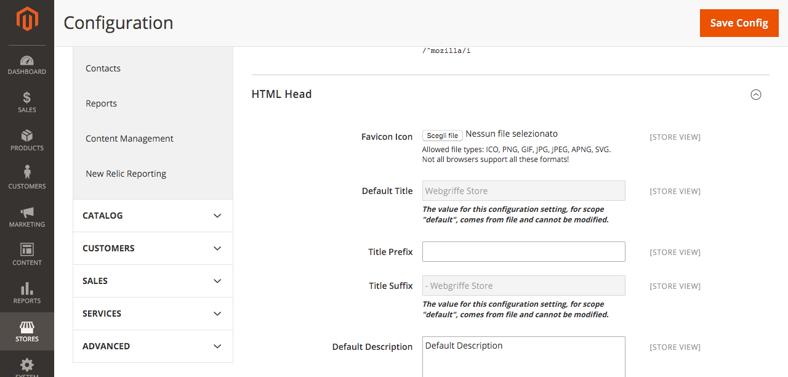

Config Override Magento 2 Module
================================

[](https://travis-ci.org/webgriffe/module-config-override)

A Magento 2 module that overrides default configuration from file which can be added to version control, inspired by this Magento 1.x extension: [https://github.com/webgriffe/config-extension](https://github.com/webgriffe/config-extension).

Installation
------------

Add this extension as dependency using [Composer](https://getcomposer.org):

	composer require webgriffe/module-config-override
	php bin/magento setup:upgrade
    
Config override
---------------

Magento configuration is driven by database. This, sometimes, is overkill and forces us to maintain upgrade script to keep Magento envorinment aligned with features development.
So, this extension enables additional config source that loads several YAML files and overrides database configuration.

Loaded YAML files are (in this order):

* `app/etc/default.yml.dist`: this intended to be under version control to distribute configuration for all environments.
* `app/etc/default.yml`: this is intendet to be ignored by version control system to provide configuration related to local needs.

Also, if the `MAGE_ENVIRONMENT` environment variable is defined, then two additiontal files are loaded. For example, if the `MAGE_ENVIRONMENT` variable value is `dev`, the following two files are loaded:

* `app/etc/default-dev.yml.dist`: as `default.yml.dist`, this is intended to be under version control to distribute configuration but only for the `dev` environment.
* `app/etc/default-dev.yml`: as `default.yml`, this is intended to be ignored by version control to provide configuration related to local needs but only for the `dev` environment.

Configuration in YAML files must be specified with the same structure of Magento system configuration, for example:

```yml
web:
  secure:
    base_url: "http://my-project-url.dev/"
  unsecure:
    base_url: "http://my-project-url.dev/"
```    
Only `default` configuration scope is overridden.

CLI notes
---------

Please note that if you use the `MAGE_ENVIRONMENT` variable then it should be **always** set when Magento is running. So is not enough to set it through your webserver (for example with a `SetEnv "dev"` in Apache) but it should also be set into your command line shell.  Otherwise, if you have the Magento's configuration cache enabled and you clear the cache from the command line, the `MAGE_ENVIRONMENT` will not be applied and you'll get unexpected behaviours.  

Remember to "export" you env variable when you run a command via shell:

```
export MAGE_ENVIRONMENT=dev && <your command> 
```

alternative you can add the `MAGE_ENVIRONMENT=dev` in your shell configuration (ex. for bash):

file `/home/<you user>/.bashrc`:

```
....
....

MAGE_ENVIRONMENT=dev
```

Overridden config values are shown in backend
---------------------------------------------

Overridden config values are shown in Magento's backend. Every config setting it's shown on its section. For example, if you have the following `default.yml` file:

```yml
design:
  head:
    default_title: Webgriffe Store
    title_suffix: - Webgriffe Store
```    

When you'll go to `Stores -> Configuration -> General -> Design` you'll find the overridden config value shown and not editable.



This feature improves a lot the usability of this extension.

To Do
-----

* Improve system config admin interface to support complex fields

Credits
-------

* Developed by [Webgriffe®](http://webgriffe.com)
